# DevOps & AWS Basics

## DevOps

#### What is DevOps?
* DevOps is a methodology in the software development/ IT. In this DevOps we used to practice different tools to integrates and automate the work of software (Dev) and IT (Ops) improving and shortening the SDLC.

#### Why DevOps?
* DevOps is culture we have collaboration, customer satisfaction, Automation, efficiency, innovation, Continuous Improvement, Quality, Security.

#### Why DevOps is Important?
* If we need applications to be delivered quickly and frequently to production, then only we need DevOps.

### Devops Concepts
#### Dev Concepts:
* Planning.
* Development.
* Testing.
* Continuous Integration.
#### Ops Concepts:
* Provisioning.
* Release.
* Monitoring.
* Continuous Integration.
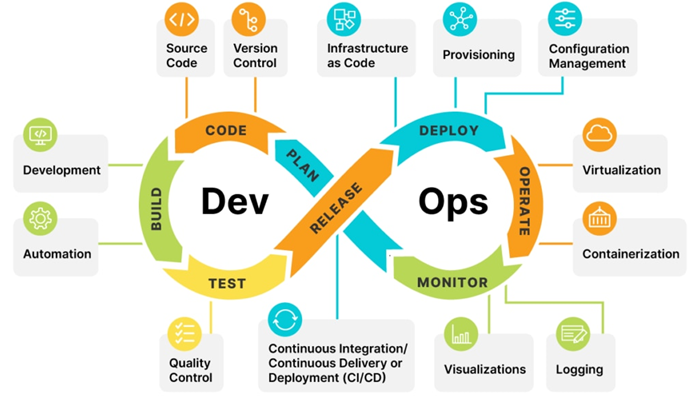

#### What are the Benefits of DevOps?
1.	Collaboration and efficiency across the entire SDLC. 
2.	Frequent and fast product delivery.
3.	Reliability (it is without failure adequately can deliver on time)
4.	Great collaboration b/w development team, Operations team and project management team.
5.	Scale (expanding or shrinking(reducing) of the system)
6.	Continuous: integration, testing, delivery, deployment.
7.	Automation and security.

### DevOps Tools

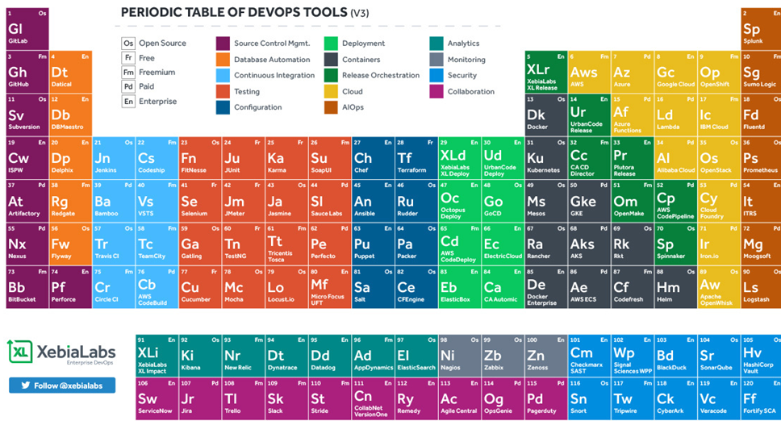

* Version Control System (VCS)
    * Git
    * SVN
    * GitHub
    * Azure Repos
    * Bit Bucket
    * AWS CodeCommit
* Continuous Integration and Continuous Delivery/Deployment (CI/CD)
    * Jenkins
    * Azure DevOps CI/CD
    * AWS Code Pipeline
    * GitHub Actions
    * Git Lab
    * Circle CI
    * Bamboo
    * Team City
    * Harness
* Configuration Management Tools (CMT)
    * Pull Based CMT (Nodes need to know about server which requires agent to be installed on the nodes).
        * Chef.
        * Puppet.
    * Push Based CMT (CM Server should be aware of the nodes)
        * Ansible.
        * Salt.
* Monitoring & Logging Tools (MLT)
    * ELK (Filebeat Agent is installed at the client servers)
    * CloudWatch (CloudWatch Agent)
    * Prometheus & Grafana (Prometheus Agent)
    * Azure monitor (Azure Monitor Agent)
    * Dynatrace (OneAgent is Installed at the client servers)
* Cloud Plarform (CP)
    * Amazon Web Services (AWS)
    * Microsoft Azure
    * Google Cloud Platform (GCP)
* Development
    * Testing
        * SonarQube(code analysis and code security)
        * Selenium
        * Postman
        * Cucumber
    * Languages
        * Python
        * Java
        * Golang
        * Dotnet
        * HTML
        * PHP
        * Ruby
    * Build
        * Maven
        * Gradle
* Artifacts
    * AWS Codeartifact
    * Azure Artifacts
    * Jfrog
    * Nexus

### Version Control System (VCS)

#### What is VCS?
* VCS is a software tool used by developers to manage changes to source code over time.Version control systems allow multiple developers to collaborate on a project simultaneously without interfering with each other's work. 

#### Why VCS?
* Version Control Systems (VCS) are indispensable tools for software development and other collaborative projects for several reasons:
    * History and Tracking
    * Collaboration
    * Backup and Recovery
    * Branching and Merging
    * Code Review and Quality Assurance
    * Auditing and Compliance
    * Experimentation and Rollback

#### Where should we use VCS?
* Software Development
* Web Development
* Data Science and Machine Learning
* Content Creation
* Open Source Projects
* Documentation

#### what is GIT?
* Git is a DevOps tool used for source code management. It is a free and open-source version control system.
* Git is used to track changes in the source code, enabling multiple developers to work together on non-linear development.

#### What is GitHub?
* GitHub is a cloud-based hosting service that lets you manage Git repositories. If you have open-source projects that use Git, then GitHub is designed to help you better manage them.

#### Git Commands:
* git init            : Initializes a new Git repository in the current directory.
* git status       : Shows the current status of the repository, including the state of  files and branches.
* git add           : Adds a file or changes to the staging area, preparing them to be committed.
* git commit    : Records the changes in the repository, creating a new commit.
* git clone        : Creates a copy of a remote repository on your local machine.
* git branch     : Shows the differences between the current state and the previous state of a file or branch.
* git push         : Uploads local commits to a remote repository, typically on GitHub.
* git pull           : Fetches and merges changes from a remote repository into the current branch.
* git fetch        : Downloads changes from a remote repository but does not merge them into the current branch.
* git config      : This command configures the user. The Git config command is the first and necessary command used on the Git command line. This command sets the author name and email address to be used with your commits.
* git log           : Displays a list of commits in reverse chronological order, showing  commit messages and other details
* git diff          : Shows the differences between the current state and the previous state of a file or branch.

### Continuous Integration and Continuous Delivery/Deployment (CI/CD)
* Continuous Integration (CI) and Continuous Delivery/Continuous Deployment (CD) are two essential practices in modern software development aimed at automating and streamlining the process of building, testing, and deploying code changes.

#### Continuous Integration (CI)
* Continuously validating my code without any bugs is continuous integration.

#### Continuous Delivery (CD)
* Continuous Delivery (CD) is a software development practice that involves automatically building, testing, and deploying code changes to production as soon as they are ready.

#### Continuous Deployment (CD)
* Continuously deployment means Code changes for application released automatically into the production.

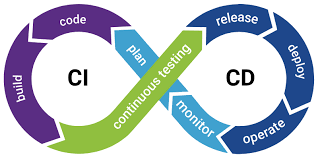

### Jenkins
* Jenkins is a software tool which allows you to do CI/CD and your application in SDLC.

#### Why Jenkins need SDLC?
* This is the code will be build and continuously and we have a plenty of Jenkins plugins, and users obtain a fresh built it provides many plugins to support to build, to automate and to deploy.

#### Workflow of Jenkins
* user push code -->build  the triggers --> validate the code --> Build output in Jenkins dashboard --> Notification in teams/email/slack about build status.
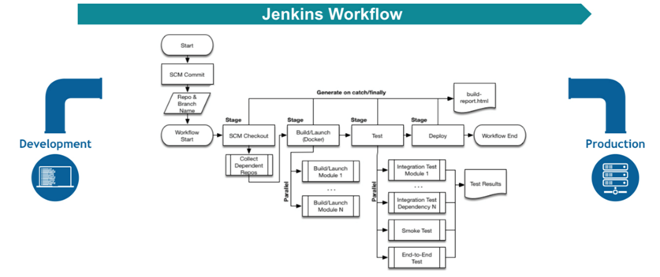

* **SCM Checkout**: cloning the code which is present in GitHub.

* **Build/Launch**: This typically involves actions such as compiling source code, running tests, packaging the application, and then deploying or executing it, all managed within the Jenkins pipeline workflow.

* **Test**:  This stage typically includes running unit tests, integration tests, or any other type of automated tests that verify the correctness and functionality of the software being developed.

* **Deploy**:  Once the code has been successfully built and tested, it's ready to be deployed. This stage involves deploying the application to the desired environment, such as staging or production. Deployment might involve pushing artifacts to a repository, provisioning infrastructure, and configuring services.

* **Notification Stage**: The purpose of notifications in Jenkins is to alert users, provide status updates, facilitate collaboration, and enable monitoring and integration with other tools and systems to keep stakeholders informed about important events and changes in the Jenkins environment.
    * **Benefits**:
        * Alerting
        * Status Updates
        * Feedback
        * Monitoring
        * Integration

* **Advantages of Jenkins**
1.	Open source
2.	Easy way to install
3.	Plenty of plugins
4.	continuous integration.
5.	Jenkins master
6.	Easy configuration Ui
7.	It will sink with any platform

#### What is Webhooks?
* Webhooks are automated messages sent from web applications when specific events occur, typically triggered by user actions.
* In Jenkins, webhooks allow you to trigger Jenkins jobs automatically based on events, such as code commits or pull requests, occurring in your version control system, like GitHub or Bitbucket.

#### What is slave and master in Jenkins? How can we use?
* **Jenkins master** is the primary server responsible for managing jobs, distributing build tasks, and coordinating the continuous integration and delivery process.
* **Slaves** in Jenkins are additional machines managed by the master to distribute build tasks, enhancing scalability and concurrency. Slaves will do the work assigned by master.

#### What is monitoring for Jenkins?
* Monitoring in Jenkins is the process of tracking system metrics, job execution statuses, and overall health to optimize performance and diagnose issues.

#### How backups of Jenkins is done?
* Backups in Jenkins are crucial to prevent data loss and ensure continuity of CI/CD processes by preserving configurations, job definitions, and plugin settings.
* Backups of Jenkins can be done by regularly exporting its home directory, containing configuration, job, and plugin data.

* **Difference b/w Jenkins and Azure DevOps CI/CD**
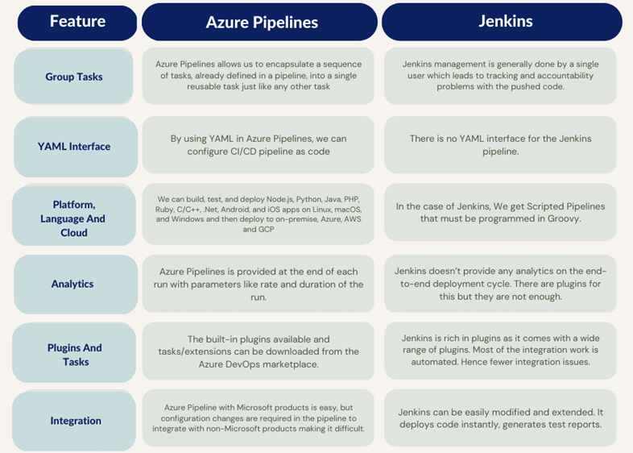

* **Difference b/w Jenkins and AWS Codepipeline** [Refer here](https://blog.ippon.tech/jenkins-vs-aws-codepipeline)

### Configuration Management Tools (CMT)

#### What is CMT?
* Configuration Management Tools (CMT) are software solutions used to automate the management of infrastructure configurations and software deployments in IT environments. These tools help streamline the process of provisioning, configuring, and maintaining servers, applications, and other components of an IT system.

#### What is Ansible?
* Ansible is an open-source automation tool used for configuration management, application deployment, and task automation. Developed by Red Hat, Ansible is written in Python and uses a simple and human-readable syntax (YAML) to define automation tasks.

* **Ansible Workflow**
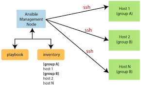

* **Key features of Ansible**
    * Agentless Architecture
    * Declarative Language
    * SSH connection and executes the small modules on the host's machine and install the software
    * Idempotent Execution
    * Modular and Extensible
    * Orchestration and Configuration Management
    * Integration with Cloud Platforms

#### What is the Ansible management node and group?
* A managed node is any device being managed by the control node. 
* Ansible works by connecting to nodes (clients, servers, or whatever you're configuring) on a network, and then sending a small program called an Ansible module to that node.
* Ansible executes these modules over SSH and removes them when finished.

* **My scenario question is you have a 5 nodes. Can you take a remote that server in node one?**
* Using SSH Keygen. you should have an access for node five from the node one.
* you should open the SSH keys.
* whenever you are going to take remote from 1 instance to another instance, maybe node one you configure Ansible.

* **one scenario question is so you are there in a master node one, master node maybe 4 remaining 4 nodes are remaining, 4 nodes configuration details I need immediately within one or two minutes one minute.**

* **how can you write a command to pull those 10 nodes information?**

* Pulling Concepts.

* 10 nodes, 10 nodes configuration details with IP address and user details and like AD details if it is all the details I need within one or two minutes.

* How can you get it 50 instances details?

* Pulling data from 50 instances.

* I'm giving you a scenarios and what time, what type of push request we will get it from client, what time for full request we will get it from client right pull and push requests.

* Why configuration tools we have?

* Basic level understanding

* How can we utilize it is if you have any questions, this is the right time to express, then we'll move on to the next level that is monitoring.

* Basics things for configuration management tool.

* We have a connection. How can we check the connections and how can we a implement push and pull the concepts.

* We have a connection. How to test connection between Ansible and Jeff puppet with the remaining nodes and how to work on Pull request and push request.

* **Difference b/w Ansible, Puppet, and Chef**
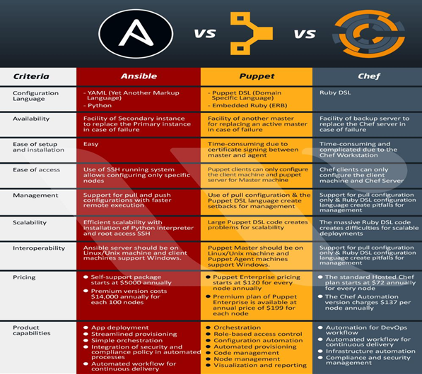

### Monitoring
* Monitoring is the action of observing and checking the behavior and outputs of a system and its components over time.
    * **System monitoring**: Basic health check for infrastructure/server up or not.

    * **Application monitoring**: Application home page accessible or not. Logs of applications. X-ray Trace – enable access from one way to another way.
    
    * **We are using AWS CloudWatch, ELK, Azure monitoring, Dynatrace, Prometheus.**

#### Agent:
* An Agent is installed in instance or any service where we have to monitoring.
* Agent will act as mediator and give information to our monitoring tool.
* Agent will collect all information about the instances/database where want to do monitoring.  

* For cloud watch for monitoring other than default metrics we have to install amazon **CloudWatch agent**.
* For Dynatrace, agent name is **OneAgent**.
* For Prometheus, agent name is **Node exporter**.
* For ELK, agent name is **beats**.

* **Why organizations are using different monitoring tools when clouds are providing monitoring?**
    * UI providing by the monitoring tools are better than cloud ones.
    * Identify the components.

### Cloud Plarform (CP)

* **Difference b/w AWS, Azure, and GCP Services?**
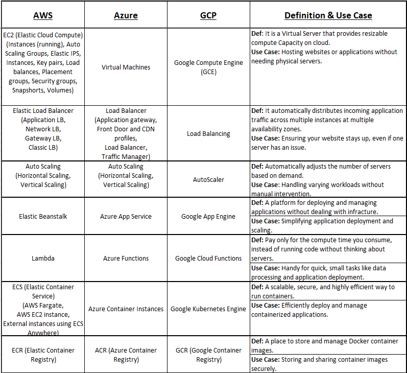
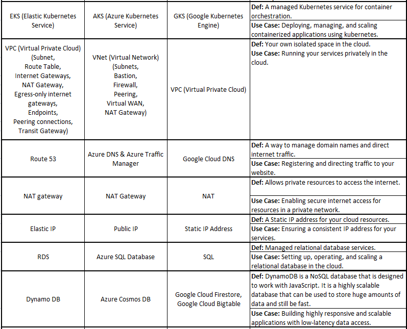

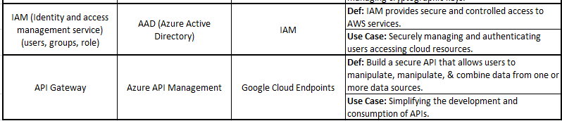

### Linux

#### What is Linux?
* Linux is a free, open source operating system, released under the GNU General Public License (GPL).

* whatever you are doing in your Windows machine, why can't we do it?
* In windows administrator as root user, In linux super user as root user.
* Apps because you should give administrator access without administrator access, you cannot install it even not only installation.
* You can uninstall it, right?
* You should give administrator access same way in Linux also if you want to create new things you have to give super user (sudoer's) permission.

* **Difference between Windows and Linux**
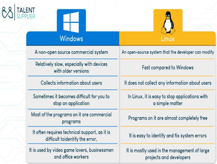

* **Difference between Windows and Linux Commands?**
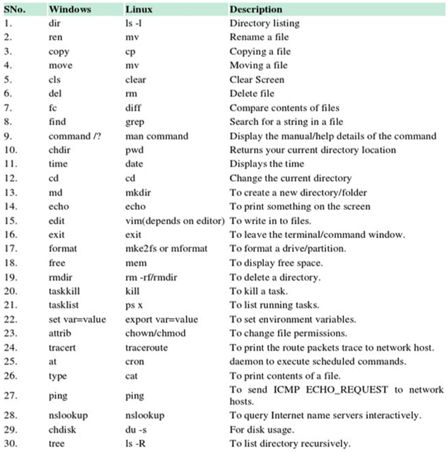

#### Linux Commands
* **ls** - List: List files and directories
* **pwd** - Print Working Directory:  Displays the current working directory
* **cd** - Change Directory: Change the current working directory
* **mkdir** - Make Directory: Create a new directory
* **touch** - Touch: Create an empty file
* **cp** - Copy: Copy files and directories
* **mv** - Move: Move or rename files and directories
* **rm** - Remove: Delete files or directories
* **chmod** - Change Mode: Change the permissions of files or directories
* **sudo** - Superuser Do: Execute a command as a superuser or another user
* **adduser** - Add User: Create a new user account
* **groupadd** - Group Add: Create a new group
* **top** - Task Manager: Display and manage running processes
* **unzip** - Unzip: Extract files from a compressed archive
* **echo** - Echo: Display a line of text
* **yum/apt** - Yellowdog Updater Modified / Advanced Package Tool: Package management utilities for installing, updating, and removing software packages in Linux
* **cat** - Concatenate: Display the contents of a file
* **ps** - Process Status: Display information about active processes
* **VIRT** - Virtual Memory Size
* **kill** - Kill: Terminate a process
* **ping** - Packet Internet Groper: Send ICMP echo requests to a network host
* **vim/vi** - Vi IMproved / Vi: Text editor for Unix-like systems
* **history** - History: Display command history
* **which** - Which: Locate a command
* **tail** - Tail: Display the last part of a file
* **head** - Head: Display the first part of a file
* **more** - More: Display output one screen at a time
* **df** - Disk Free: Display disk space usage
* **grep** - Global Regular Expression Print: Search for patterns in text files
* **wget** - Web Get: Download files from the internet
* **find** - Find: Search for files and directories
* **curl** - Client URL: Transfer data to or from a server, supporting multiple protocols
#### Networking commands:
* **nslookup** - Name Server Lookup: Performs DNS lookups to retrieve domain name or IP address information.
* **netstat** - Network Statistics: Displays network connections, routing tables, interface statistics, and more.
* **mtr** - My Trace Route: Combines traceroute and ping functionalities to provide detailed network path and latency information.
* **ifconfig** - Interface Configuration: Displays and configures network interface parameters such as IP addresses and netmasks.
* **htop** - 

### VM vs Container vs On-Premises
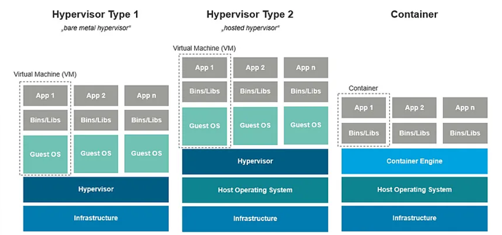

* Earlier we used to run applications directly on physical servers and then we moved to hypervisors to cut down the Capex (Capital Expenditure) and OpEX (Operation Expenditure)
* Host Operating System: A host is any hardware device that has the capability of permitting access to a network via a user interface, specialized software, network address, protocol stack, or any other means.
* Hypervisor: A hypervisor is a software that creates and manages virtual machines, allowing multiple operating systems to run on a single physical machine simultaneously.
* Virtual Machine (VM): A virtual machine is a software emulation of a physical computer, allowing multiple operating systems to run concurrently on a single physical machine.
* Containers: Containers are lightweight, portable, and isolated software packages that contain everything needed to run an application, including libraries and dependencies.
* A container is a bundle of Application, Application libraries required to run your application and the minimum system dependencies.
* A container is a standard unit of software that packages up code and all its dependencies so the application runs quickly and reliably from one computing environment to another. A Docker container image is a lightweight, standalone, executable package of software that includes everything needed to run an application: code, runtime, system tools, system libraries and settings.

#### Difference b/w Virtual machine (VMs) and containers
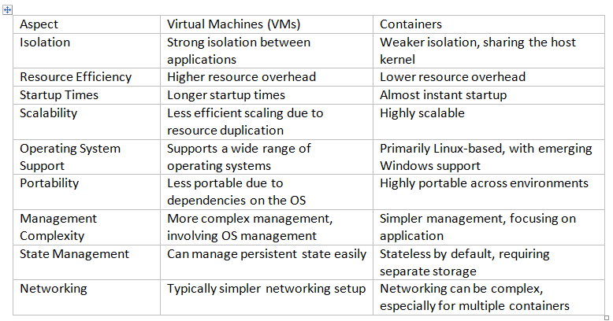

* **Static IP**:When a device is assigned a static IP address, the address does not change.
* **Dynamic IP**:Most devices use dynamic IP addresses, which are assigned by the network when they connect and change over time.

